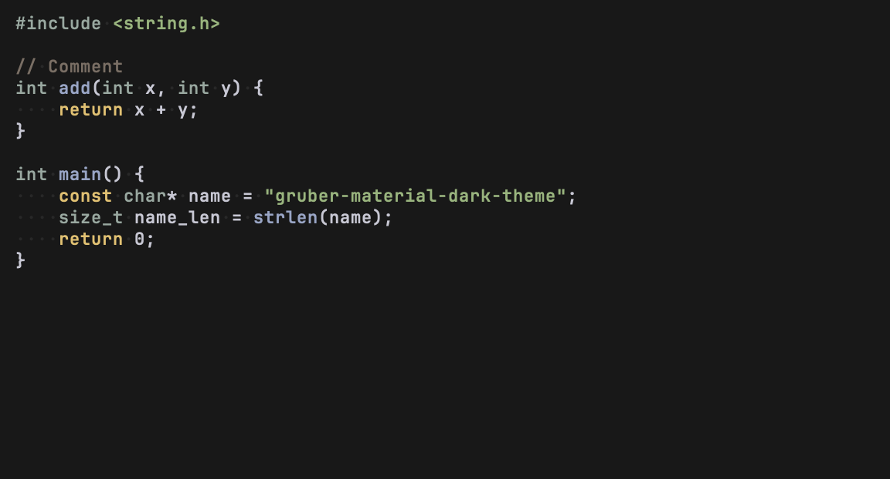
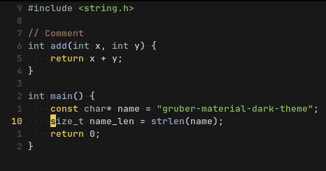

# Gruber Material Dark
Neovim port of [Gruber Material Dark](https://github.com/FilippoBSW/gruber-material-dark) for Emacs.

Based on [Gruber Darker](https://github.com/rexim/gruber-darker-theme) and inspired by [Gruvbox Material](https://github.com/sainnhe/gruvbox-material).

## Screenshot

#### Default


#### Intense *(closer to the original, but still softer)*



## Installation
### Lazy.nvim
``` lua
{ 'FilippoBSW/gruber-material-dark.nvim', lazy = false, priority = 1000 }
```
## Usage
``` lua
vim.cmd.colorscheme("gruber-material-dark") ; or gruber-material-dark-intense
```
